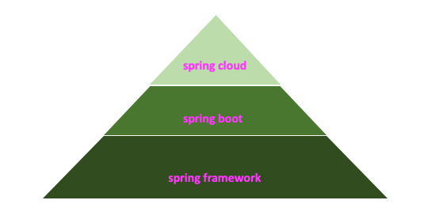
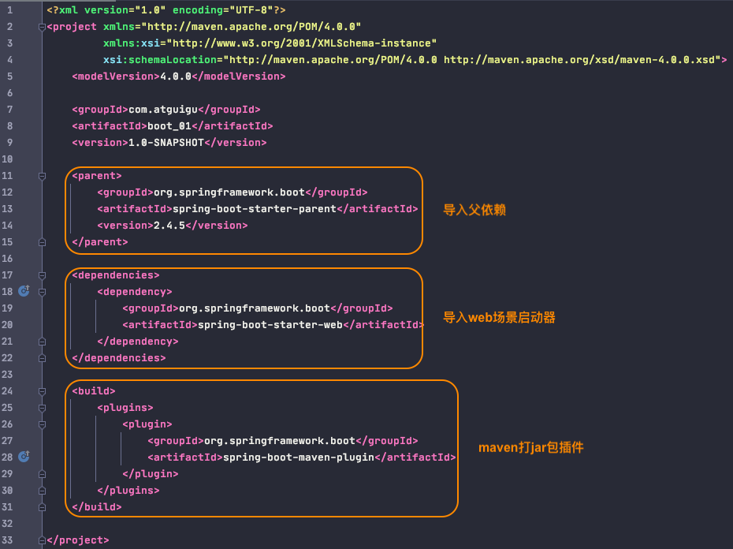
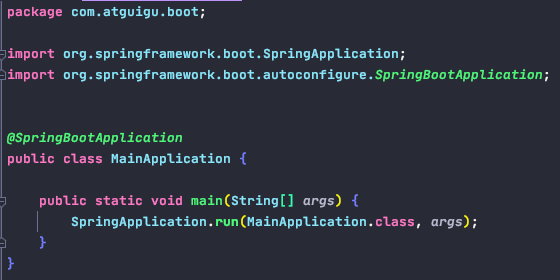
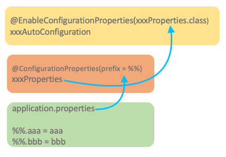
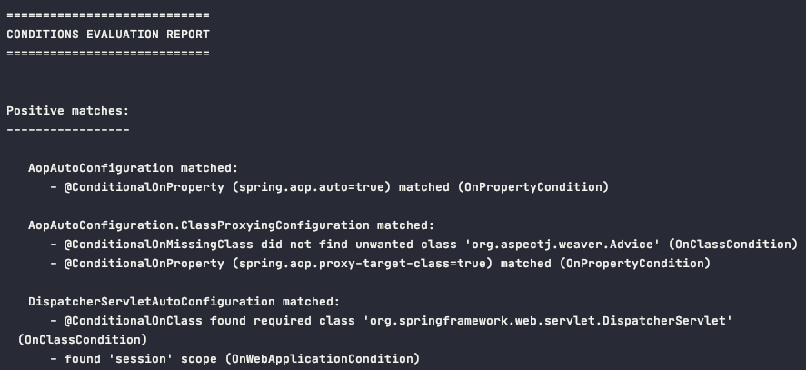
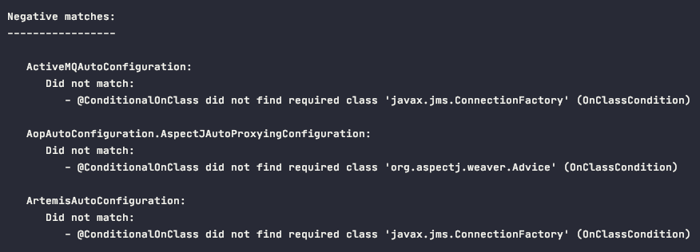

# Spring Boot

0. Spring Boot的优点
        
        - 快速构建一个独立的Spring应用程序
        - 嵌入的Tomcat, Jetty或者Undertow, 无需部署WAR文件
        - 提供starter POMs来简化Maven配置和减少版本冲突所带来的问题
        - 对Spring和第三方库提供默认配置, 可直接修改默认值, 以简化框架配置
        - 无需配置XML, 无代码生成, 开箱即用
        - 提供生产就绪型功能, 如指标, 健康检查和外部配置
        - 主要是被微服务需求带动起来 (spring cloud是微服务, 而spring cloud是基于spring boot开发的), 可以说spring cloud带动了spring boot, 而spring boot成就了spring cloud
        

1. basic start

2. SpringBoot AutoConfiguration 源码

        @SpringBootApplication
            @SpringBootConfiguration
                @Configuration
            @ComponentScan
            @EnableAutoConfiguration
                @AutoConfigurationPackage 自动配置包 -- 将MainApplication.class所在包下的所有组件注册到容器中, 通过@Import(Registrar.class)
                    @Import(Registrar.class) 利用registrar给容器中导入一系列组件, 不是只导入一个组件, 而是导入一批; 这些组件都在MainApplication.class所在包下
                @Import(AutoConfigurationImportSelector.class)
                    selectImports()
                        getAutoConfigurationEntry(annotationMetadata) 获取所有自动配置类集合
                            1). getCandidateConfigurations(annotationMetadata, attributes) 获取所有需要导入容器中的自动配置类(total: 130 configurations) -- xxxAutoConfiguration.class
                                SpringFactoryLoader.loadFactoryNames(factoryType: EnableAutoConfiguration.class, classLoader: beanClassLoader)
                                    loadSpringFactories(classLoader).getOrDefault(factoryTypeName: EnableAutoConfiguration.class, Collections.emptyList())
                                        classLoader.getResource("META-INF/spring.factories") 加载项目中所有dependency中META-INF/spring.factories文件中指定的信息
                            2). deduplicate configurations
                            3). exclude configurations
                            4). filter configurations
        
        总结: 
            - SpringBoot先加载所有的自动配置类 xxxAutoConfiguration
            - 每个自动配置类按照条件进行生效, 默认都会绑定一个属性bean -- xxxProperties.class, 这个属性bean会绑定属性文件(application.properties)并指定一个prefix用于配置这个属性bean
            - 生效的配置类会给容器中装配很多组件
            - 只要容器中有这些组件, 相当于就有了这些功能
            - 所谓的定制化配置:
                1). 用户直接自己@Bean替换底层的组件, 底层xxxAutoConfiguration文件中的@ConditionalOnMissingBean注解生效
                2). 用户直接修改application.properties属性文件, 这个属性文件会绑定特定的属性bean, 属性bean会被注入到xxxAutoConfiguration组件中, 从而定制xxxAutoConfiguration的行为

        application.properties中开启自动配置报告 -- 查看所有生效的xxxAutoConfiguration.class
            debug=true
    

