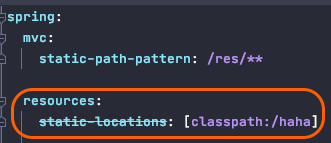
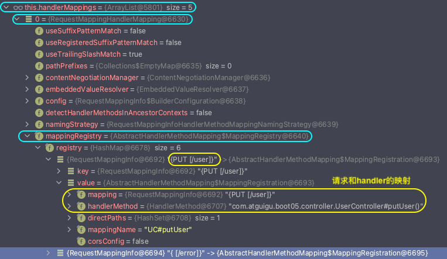
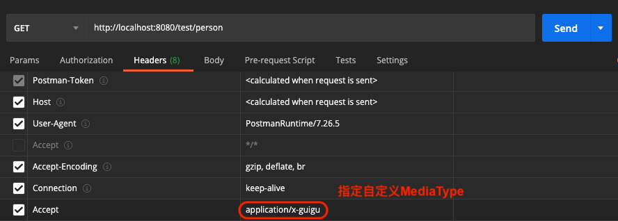

# Spring Boot

0. Spring Boot的优点
        
        - 快速构建一个独立的Spring应用程序
        - 嵌入的Tomcat, Jetty或者Undertow, 无需部署WAR文件
        - 提供starter POMs来简化Maven配置和减少版本冲突所带来的问题
        - 对Spring和第三方库提供默认配置, 可直接修改默认值, 以简化框架配置
        - 无需配置XML, 无代码生成, 开箱即用
        - 提供生产就绪型功能, 如指标, 健康检查和外部配置
        - 主要是被微服务需求带动起来 (spring cloud是微服务, 而spring cloud是基于spring boot开发的), 可以说spring cloud带动了spring boot, 而spring boot成就了spring cloud
        

1. basic start

2. SpringBoot AutoConfiguration 源码

        @SpringBootApplication
            @SpringBootConfiguration
                @Configuration
            @ComponentScan
            @EnableAutoConfiguration
                @AutoConfigurationPackage 自动配置包 -- 将MainApplication.class所在包下的所有组件注册到容器中, 通过@Import(Registrar.class)
                    @Import(Registrar.class) 利用registrar给容器中导入一系列组件, 不是只导入一个组件, 而是导入一批; 这些组件都在MainApplication.class所在包下
                @Import(AutoConfigurationImportSelector.class)
                    selectImports()
                        getAutoConfigurationEntry(annotationMetadata) 获取所有自动配置类集合
                            1). getCandidateConfigurations(annotationMetadata, attributes) 获取所有需要导入容器中的自动配置类(total: 130 configurations) -- xxxAutoConfiguration.class
                                SpringFactoryLoader.loadFactoryNames(factoryType: EnableAutoConfiguration.class, classLoader: beanClassLoader)
                                    loadSpringFactories(classLoader).getOrDefault(factoryTypeName: EnableAutoConfiguration.class, Collections.emptyList())
                                        classLoader.getResource("META-INF/spring.factories") 加载项目中所有dependency中META-INF/spring.factories文件中指定的信息
                            2). deduplicate configurations
                            3). exclude configurations
                            4). filter configurations
                            

        
        自动配置总结: 
            - SpringBoot先加载所有的自动配置类 xxxAutoConfiguration
            - 每个自动配置类按照条件进行生效, 默认都会绑定一个属性bean -- xxxProperties.class, 这个属性bean会绑定属性文件(application.properties)并指定一个prefix用于配置这个属性bean
            - 生效的配置类会给容器中装配很多组件
            - 只要容器中有这些组件, 相当于就有了这些功能
            - 所谓的定制化配置:
                1). 用户直接自己@Bean替换底层的组件, 底层xxxAutoConfiguration文件中的@ConditionalOnMissingBean注解生效
                2). 用户直接修改application.properties属性文件, 这个属性文件会绑定特定的属性bean, 属性bean会被注入到xxxAutoConfiguration组件中, 从而定制xxxAutoConfiguration的行为

            - application.properties中开启自动配置报告 -- 查看所有生效的xxxAutoConfiguration.class
                debug=true
    

3. 配置绑定 

        - 将spring bean的属性值和application.properties/ application.yml的属性值绑定
        

       - 实现方式一: @ConfigurationProperties + @Component
       

       - 实现方式二:

        

4. Web开发

    1). 静态资源访问
            - 文件夹: /public, /resources, /static, /META-INF/resources

            - 访问: 当前项目根路径/ + 静态资源名
            - 原理: 请求进来, 先去找controller看能不能处理, 如果不能处理, 再交给静态资源处理器, 
                    如果静态资源处理器也找不到就返回404
            - 设置静态资源访问路径前缀: 
                - default没有, /**
                - spring.mvc.static-path-pattern: /res/**

            - 设置额外的静态资源文件夹:
                - spring.resources.static-locations: classpath:/haha

    2). DispatcherServlet 派发请求源码
    DispatcherServlet:
        doService(req, res):
            doDispatch(req, res):
                getHandler(processedRequest) ===> HandlerExecutionChain
                    handlerMappings: 中的mappingRegistry保存了@RequestMapping和handler的映射关系
                    

                    
                        遍历每一个handlerMapping.getHandler(request), 如果找到匹配的(HandlerExecutionChain)handler就返回

    3). @RequestAttribute
            - 将数据存放在request域中, 转发到的请求可以取出数据

    
    4). @MatrixVariable
            - ; to saperate url path and parameters

    5). ArgumentResolver 参数解析器原理
            - 自定义对象参数绑定原理 (ServletModelAttribute)
            - 自定义converter进行类型转换
    
    DispatcherServlet.doDispatch():
        1>. mappendHandler = getHandler();
        2>. ha = getHandlerAdapter(); 查找匹配的处理器适配器
                遍历所有的HandlerAdapter, 如果支持handler(supports(handler)), 则返回那个adapter
                此处返回的是: RequestMappingHandlerAdapter
        3>. mv = ha.handle(request, response, handler); 执行目标方法
                    ha.handleInternal(req, res, handler);
                        ha.invokeHandlerMethod(req, res, handler);
                            invocableMethod.setHandlerMethodArgumentResolver (27个argumentResolvers) 设置参数解析器
                            invocableMethod.setHandlerMethodReturnValueHandlers (15个returnValueHandlers)
                            invokeForRequest(request, mavContainer, providedArgs) -- 真正为参数赋值
                                getMethodArgumentValues(request, mavContainer, providedArgs)
                                    #1. MethodParameter[] parameters = getMethodParameters(); 拿到所有方法参数
                                    #2. 为每一个参数找到支持解析它的ArgumentResolver
                                            遍历所有MethodParameters: 
                                                遍历所有的ArgumentResolvers:
                                                    if(某个argumentResolver支持解析这个MethodParameter):
                                                        返回这个argumentResolver;
                                                报出没有找到合适的参数解析器异常;
                                                
                                            resolver.resolveArgument(); 参数解析器来解析参数
                                            根据参数的key, 从requestAttribute(request作用域)中拿到参数的值, 并赋给参数位置指定变量
                                            

    6). ReturnValueHandler 返回值处理器原理 | HTTPMessageConverter 消息转换器原理 | ContentNegotiation 内容协商原理
        
        1. ReturnValueHandler 返回值处理器原理:
        
            a. 如果有返回值, 触发返回值处理机制
            b. 遍历所有的returnValueHandlers, 找到支持返回值类型的returnValueHandler, handler.supportsReturnType(returnType)
            c. returnValueHanlder调用handleReturnValue()方法进行返回值处理:
                    #0. 调用writeWithMessageConverters(returnValue, returnType, inputMessage, outputMessage)方法 -- 使用消息转换器将返回值数据写为JSON
                            - MediaType内容协商: 浏览器以请求头的方式告诉服务器它可以接受什么内容类型, 以及权重 (xml权重 > JSON权重), 服务器遍历所有MessageConverters, 找到所有能操作返回值类型的MessageConverters, 汇总他们可以提供的所有媒体类型, 并最终选出一个最合适的MediaType -- selectedMediaType, 详见2.内容协商原理
                            - 又遍历所有HttpMessageConverters, 找到可以处理将返回值类型转化成选定媒体类型的messageConverter, 通过调用canWrite(clazz, selectedMediaType)方法, eg: MappingJackson2HttpMessageConverter可以将任何数据类型转成JSON

                        
                            - 选定的MessageConverter进行转换, 将返回的媒体类型数据flush()给response对象
                        
                        
        2. ContentNegotiation 内容协商原理 （Http协议规定, 请求头的Accept属性可以指定客户端支持接收的MediaType):
            
            a. 判断当前响应头中是否已经有确定的媒体类型
            b. 获取客户端支持的媒体类型(Postman, browser) -- 请求头的Accept字段 -- 赋值给acceptableTypes
                    - 开启支持参数内容协商策略
                    

                    - 发送请求, 附加参数 ?format=xxx

                    
                    - contentNegotiationManager.resolveMediaTypes(request)

                        - 遍历所有的内容协商strategies(默认使用HeaderContentNegotiationStrategy), ParameterContentNegotiationStrategy 优先于 HeaderContentNegotiationStrategy

                                            
                            调用strategy.resolveMediaTypes(request):
                                - ParameterContentNegotiationStrategy
                                    获取“format"属性的值

                                    
                                - HeaderContentNegotiationStrategy: 
                                    获取HttpHeader.ACCEPT属性值
                                
            c. 遍历循环所有的MessageConverters, 找到支持操作(写)返回值对象类型的MessageConverter -- 将所有可以转化成的MediaType, 并赋值给producibleTypes
            d. 匹配所有可以的MediaTypes, 将匹配的MediaType并赋值给mediaTypesToUse
                

            e. 选择匹配度最高的MediaType, 赋值给selectedMediaType (唯一)
            g. 遍历所有的MessageConverters, 用canWrite(returnType, MediaType)的messageConverter (MappingJackson2HttpMessageConverter) 进行写操作给response

    
        3. HTTPMessageConverter 定制消息转换器处理定制的MediaType:
        

